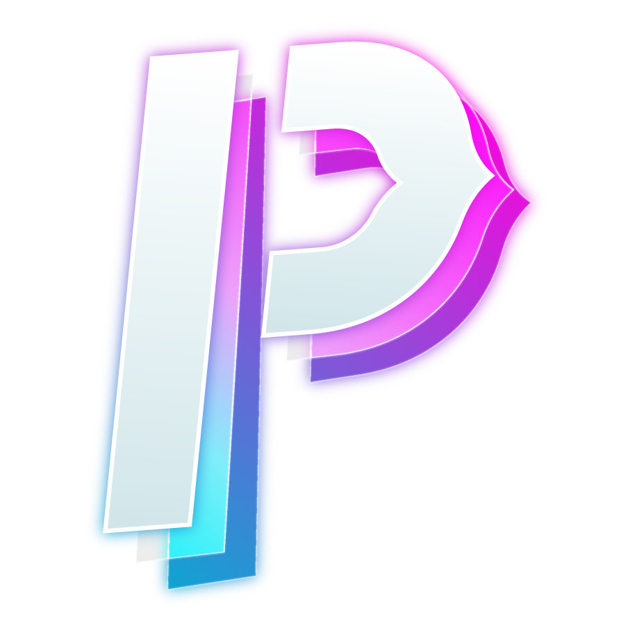
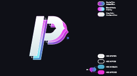
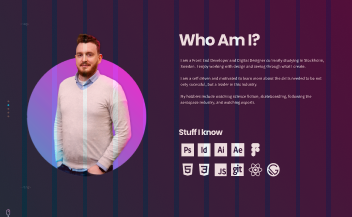

<!-- AUTO-GENERATED-CONTENT:START (STARTER) -->

    

<h1 align="center">
  Paul Fleming Portfolio Page
</h1>

Welcome to the repo for my personal portfolio page. This is my first real page to showcase the work/learning I have been doing at Hyper Island and beyond. My intention is to continue to improve and refine the page as I learn more and grow more confident in wed development.

Care to see the deployed site? [Check it out!](https://fleming.digital).
## 🔧 The Process

1.  **First Steps**

    I started with logo development based around some ideas and inspiration I had found. This process had me developing multiple logos, and creating multiple pages (not sure if I hid all the repos they are contained in). I finally settled on the idea towards the first half of 2021 and began the process of developing the design soon after. 
     
2.  **Creating the Design**

    I created most of the logo assets and design guide in Adobe Illustrator, settling on the color pallette and font choices. These evolved some from the initial design but was mostly settled on early.  
     
    After the initial design stage I went into Figma and created the overall layout and created some simple rules to follow. This is always a key step for me so I can think less about the design and more troubleshooting when developing.  
    

3.  **Developing The Page**

    In the pursuit of learning I decided I wanted to use a headless CMS with Gatsby to create the page. I decided to go with the blog starter and quickly started deleting everything. I developed this site mobile first, which was the first for me. It helped speed up the development of the desktop site dramatically.  
    Contentful was my CMS of choice as I had used it before on a school project you can [view here](https://github.com/wikidbrit/c_c-Ricola) for Ricola. That at least gave me some familiarity with the site and how to integrate it into my page.  
    It has been a real learning experience and frankly struggle to get to this point and the project continues to grow as I learn more and more. 

## 🚗 Whats Coming Next

1. DONE
2. I would like to render buttons depending on if the information is available from the CMS. I have the basis of that figured out. 
3. DONE
4. Animations!!
5. CMS content needs to be added and I need to narrow down the projects I plan to show.
6. Clean the repo some to remove the placeholder assets provided by Gatsby.
7. Refine page transitions and subtile scroll reveal.

    

